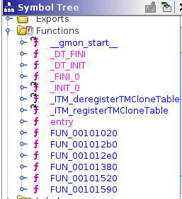

# Disassembly report

This small report contains the results of a small disassembly experiment performed on two ELF binaries.

This report is based on the [USENIX paper](https://www.usenix.org/system/files/conference/usenixsecurity16/sec16_paper_andriesse.pdf) "An In-Depth Analysis of Disassembly on Full-Scale x86/x64 Binaries".

## ELF binaries choice
First, let's pick the two binaries we want to disassemble.

In the paper, the following code sources are used:
- SPEC CPU2006 C
- glibc-2.22
- nginx v1.8.0
- lighttpd v1.4.39
- opensshd v7.1p2
- vsftpd v3.0.3
- exim v4.86

A huge binary would be too long to analyze completely, so I decided to pick two small binaries with no dependencies.

After looking at a couple of binaries, I decided to pick the two following x86_64 ELF binaries:
- `lighttpd-angel` from [lighttpd](https://github.com/lighttpd/lighttpd1.4)
- `pcprofiledump` from [glibc](https://github.com/bminor/glibc)

All the source files are available in the [src](src) directory, and the corresponding binaries are available in the [bin](bin) directory.

## Disassembler choice
Now, we need to choose a disassembly tool.
In the paper the following tools are evaluated:
- Linear disassemblers
	- objdump v2.22
	- PSI v1.1
- Recursive disassemblers
	- IDA Pro v6.7
	- Hopper v3.11.5
	- Dyninst v9.1.0
	- BAP v0.9.9
	- angr v4.6.1.4
	- ByteWeight v0.9.9
	- Jakstab v0.8.4

It is important to note that this paper is from August 2016. The reverse engineering tools evolved a lot in 5 years. Re-performing this analysis nowadays would probably yield very different results. The disassembly results would probably be much better as the tools improved. The tools analyzed would also probably be very different too.

IDA Pro has been the leader tool for many years, but this is starting to change.
For example Binary Ninja, released in 2016, or Ghidra, released by the NSA in 2019 are two very interesting competitors.

IDA Pro, Hopper and Binary Ninja are paid products, and the free versions are very restricted (time-limited sessions, no save options, ...).

I decided to pick Ghidra, a tool that is not in the original paper because it didn't exist at that time. 
It's a very popular tool, mostly because it is completely free and open-source, supports plugins, has a great decompiler and has all the features from other paid products. I also already used this tool and I am familiar with it.

This repository contains the two exported Ghidra zip files for the 2 ELF files.

## lighttpd-angel binary disassembly
Before diving into the disassembly part, let's first look at the manual page for this binary to have a basic idea of what it does:

> lighttpd-angel monitors/supervises lighttpd daemon (started with \<args\>). lighttpd-angel will restart lighttpd if lighttpd exits for any reason, other than by signals sent by lighttpd-angel.
> Send lighttpd-angel SIGINT to initiate graceful shutdown of lighttpd.
> Send lighttpd-angel SIGTERM to initiate shutdown of lighttpd.
> Send lighttpd-angel SIGHUP to initiate restart of lighttpd, reloading config.

This binary is a supervisor for the `lighttpd` daemon. 
It will create a forked `lighttpd` process and restart it if it dies. 
The supervisor can perform various actions depending on the signal we send it (shutdown, restart, ...).

Let's now load the binary into Ghidra.

Looking at the symbol tree, we see that Ghidra didn't manage to find the `main` function.



Any ELF binary has an entry point that will call the `libc_start_main` function from the libc library. This function will perform various initializations for the binary and then jump to the main function address, which it takes as its first argument.

Looking at the decompiler view of ghidra, we see the following call is made:
```c
__libc_start_main(FUN_00101020, in_stack_00000000, &stack0x00000008, FUN_00101520, FUN_00101590, param_3, auStack8);
```

This means that the function `FUN_00101020` is our main address. We can rename it in Ghidra.

Let's jump to the main function. Let's analyze the program part by part.

First, we have the different variables declarations:

```c
  __pid_t _Var1;
  int *piVar2;
  char *pcVar3;
  ulong *puVar4;
  uint uVar5;
  long in_FS_OFFSET;
  undefined8 uVar6;
  uint local_cc;
  undefined local_c8 [152];
  ulong local_30;
  
  local_30 = *(ulong *)(in_FS_OFFSET + 0x28);
  local_c8._0_8_ = (code *)0x1;
  *argv = "/usr/bin/lighttpd";
  puVar4 = (ulong *)(local_c8 + 8);
```

Then, we notice a weird for loop:

```c
  for (pcVar3 = (char *)0x12; pcVar3 != (char *)0x0; pcVar3 = pcVar3 + -1) {
    *puVar4 = 0;
    puVar4 = puVar4 + 1;
  }
```

this corresponds to the following assembly instruction:

```asm
STOSQ.REP param_1
```

This is typical of mis-decompiled `memset` calls, we are probably setting all bytes of variable `puVar4` to 0.

Then, we are performing various calls to the `sigaction` function, this is to set the various signal handlers.

```c
  sigaction(0xd,(sigaction *)local_c8,(sigaction *)0x0);
  sigaction(10,(sigaction *)local_c8,(sigaction *)0x0);
  local_c8._0_8_ = FUN_00101380;
  sigemptyset((sigset_t *)(local_c8 + 8));
  local_c8._136_4_ = 4;
  sigaction(2,(sigaction *)local_c8,(sigaction *)0x0);
  sigaction(0xf,(sigaction *)local_c8,(sigaction *)0x0);
  sigaction(10,(sigaction *)local_c8,(sigaction *)0x0);
  sigaction(1,(sigaction *)local_c8,(sigaction *)0x0);
  sigaction(0xe,(sigaction *)local_c8,(sigaction *)0x0);
  sigaction(0x11,(sigaction *)local_c8,(sigaction *)0x0);
```

We can easily guess that the function `FUN_00101380` is our signal handling function.
We can also guess that the variable `local_c8` is our sigaction struct.
Let's rename all these variable accordingly.

We then arrive on the main program loop:

```c
  do {
    while( true ) {
      local_cc = 0;
      if (DAT_00104014 != 0) {
        DAT_00104010 = fork();
        if (DAT_00104010 == 0) {
          execvp(*argv,argv);
                    /* WARNING: Subroutine does not return */
          _exit(1);
        }
        uVar5 = DAT_00104010;
        if (DAT_00104010 == 0xffffffff) goto LAB_00101200;
        DAT_00104014 = 0;
      }
      uVar6 = 0x101178;
      _Var1 = waitpid(DAT_00104010,(int *)&local_cc,0);
      if (_Var1 == -1) break;
      uVar5 = local_cc & 0x7f;
      if (uVar5 == 0) {
        __fprintf_chk(stderr,1,"%s.%d: child (pid=%d) exited normally with exitcode: %d\n",
                      "lighttpd-angel.c",0x94,DAT_00104010,local_cc >> 8 & 0xff,pcVar3);
        goto LAB_00101200;
      }
      if ('\x01' < (char)((char)uVar5 + '\x01')) {
        pcVar3 = "lighttpd-angel.c";
        __fprintf_chk(stderr,1,
                      "%s.%d: child (pid=%d) exited unexpectedly with signal %d, restarting\n",
                      "lighttpd-angel.c",0x9c,DAT_00104010,uVar5,uVar6);
        DAT_00104014 = 1;
      }
    }
    piVar2 = __errno_location();
  } while ((*piVar2 != 10) || (uVar5 = DAT_00104014, DAT_00104014 != 0));
```

We can easily understand the logic with what we know of this program:
- First, we create a fork process that will execute our `lighttpd` process using the `execvp` system function.
- Once this is done, we are waiting for the child process to end using the `waitpid` function
- Depending on the return code of the child process, we print a different message to `stderr`.
- We loop.

This concludes our rough reverse engineering of this program, we understood the main logic behind it. Of course, we could have gone deeper and analyzed the signal handling function for example..

## pcprofiledump binary disassembly
Again, let's have a look at the man page for this binary:

> Dump information generated by PC profiling.

That is not a lot of informations, we'll have to find out what it does.
Let's load the binary into Ghidra.

Again, Ghidra doesn't manage to detect the main function, but we can easily retrieve it.

```c
local_40 = *(long *)(in_FS_OFFSET + 0x28);
setlocale(6,"");
textdomain(&_libc_intl_domainname);
argp_parse(&PTR_PTR_s_unbuffered_00104020,param_1,param_2,0,&local_60,0);
```

In the first part, the program sets the locale, retrieves the current message domain and parses the different arguments we give it.

We then enter the main loop.

Unfortunately, I did not manage to find out what this program purpose was.
The main logic looks very obscure.
Looking at the disassembly or decompiler view did not help me.

You can find a part of the main logic below, we can see that it is very hard to understand.

It looks like we are performing various bits operations, but it is hard to figure out why.

```c
[...]
if (uVar5 == 0xb0de) {
uVar7 = local_50 >> 0x38 | (local_50 & 0xff000000000000) >> 0x28 |
		(local_50 & 0xff0000000000) >> 0x18 | (local_50 & 0xff00000000) >> 8 |
		(local_50 & 0xff000000) << 8 | (local_50 & 0xff0000) << 0x18 |
		(local_50 & 0xff00) << 0x28 | local_50 << 0x38;
uVar9 = (ulong)(uStack84 >> 0x18) | (((ulong)uStack84 & 0xff0000) << 0x20) >> 0x28 |
		(((ulong)uStack84 & 0xff00) << 0x20) >> 0x18 |
		(((ulong)uStack84 & 0xff) << 0x20) >> 8 |
		((ulong)local_58 & 0xff000000) << 8 | ((ulong)local_58 & 0xff0000) << 0x18 |
		((ulong)local_58 & 0xff00) << 0x28 | uVar9 << 0x38;
}
[...]
```

After cheating and looking at the source code for this program, it is a bit clearer although not perfectly clear what it does.

It looks like this is a program that expects a profile dump with a specific format as its input and that loops over the results to display them. I couldn't find much informations about it online, it looks like this program is used internally by glibc.

## Conclusion
This short experiment was very interesting. I learned more about disassembly tools, how to use them and how powerful they can be.

I analyzed 2 binaries, one whose logic was rather straightforward and very easy to disassemble and the other that was very obscure and that I did not really manage to understand.
We can notice that Ghidra performed way better on the "classical" simple binary as opposed to the more complex one.

In this experiment, we had access to the source code of both binaries, but in most real-life case scenarios, reverse engineering is performed on blackbox binaries, i.e. binaries without source code available.

This experiment made me want to get better in reverse engineering. With more assembly experience for example, I would probably be able to recognize code patterns more easily (like the `memset` pattern for example).
